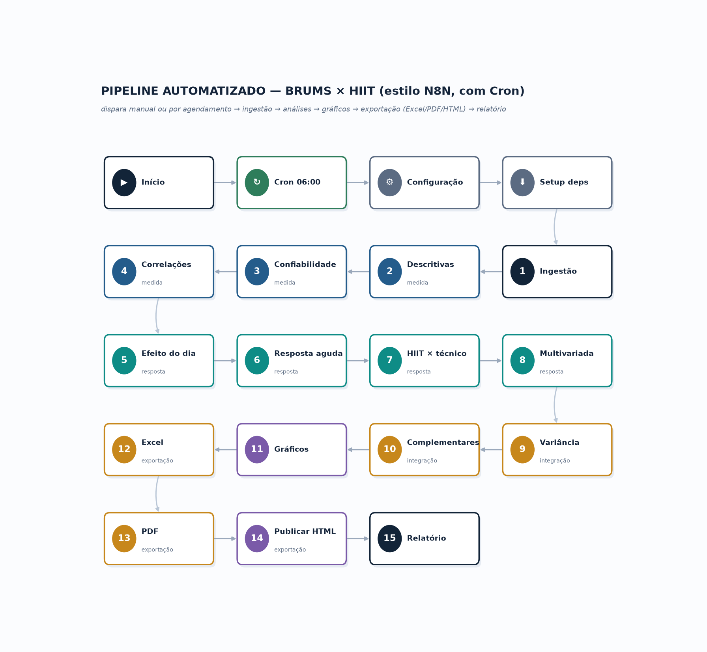

# Pipeline automatizado — BRUMS × HIIT (estilo N8N)

Automatiza **toda** a análise do estudo: da coleta bruta às tabelas, gráficos e relatório —
reproduzível com **um comando**. Organizado em **nós encadeados** (como um fluxo N8N).



## Nós do pipeline

| # | Nó | O que faz | Saída |
|---|----|-----------|-------|
| — | `ingest` | lê `COLETAS.xlsx` (+`HIIT_FC_PSE.xlsx`), monta a base limpa (dia, momento, subescalas, PTH) | `tables/00_base_limpa.csv` |
| A | `descriptives` | média, DP, mediana, IQR, assimetria, curtose, % piso | `01_descritivas.csv` |
| A | `reliability` | α de Cronbach e r inter-item por subescala | `02_confiabilidade.csv` |
| A | `correlations` | subescalas × fadiga física/mental e estado | `03_correlacoes.csv` |
| B | `day_effect` | médias diárias (2 passos) e prevalência do iceberg | `04_medias_diarias.csv`, `04b_iceberg.csv` |
| B | `acute` | resposta aguda pré→pós (Δ, dz, p, FDR) | `05_resposta_aguda.csv` |
| B | `hiit` | HIIT vs. técnico-tático (nível do dia) | `06_hiit_vs_sem.csv` |
| B | `multivariate` | Hotelling T² (6 subescalas e eixo Vigor+Fadiga) | `07_multivariada.csv` |
| C | `variance` | decomposição traço/dia/estado (modelo misto) | `08_variancia.csv` |
| C | `complementary` | mudança semanal D1→D7 (IC bootstrap), tipologia (k-médias), rede | `09–11_*.csv` |
| out | `charts` | gera os gráficos (PNG) a partir dos resultados | `charts/*.png` |
| exp | `export_excel` | consolida todas as tabelas em um único Excel (uma aba por tabela) | `BRUMS_HIIT_resultados.xlsx` |
| exp | `export_pdf` | monta um relatório PDF (capa com KPIs + uma página por gráfico) | `BRUMS_HIIT_relatorio.pdf` |
| exp | `publish` | gera um relatório HTML autocontido (gráficos + tabelas embutidos) | `relatorio.html` |
| out | `report` | consolida `manifest.json` e `summary.md` | `manifest.json`, `summary.md` |

## Como rodar

```bash
pip install pandas numpy scipy statsmodels scikit-learn matplotlib openpyxl
export BRUMS_DATA_DIR=/caminho/para/os/xlsx      # pasta com COLETAS.xlsx e HIIT_FC_PSE.xlsx
python3 pipeline.py                # roda todos os nós
python3 pipeline.py --only acute,hiit   # roda nós específicos (ingest é sempre executado)
python3 pipeline.py --list         # lista os nós
```

Saídas em `pipe/tables/*.csv`, `pipe/charts/*.png`, `pipe/manifest.json`, `pipe/summary.md`.
Uma execução de exemplo está em `exemplo_saidas/`.

## Rodar no N8N

Importe `workflow_n8n.json` (Menu → *Import from File*). O fluxo tem **dois gatilhos** ligados à mesma
cadeia — **Início (manual)** e **Agendamento (Cron)** — seguidos de **Configuração** (define
`BRUMS_DATA_DIR` e o diretório do repositório) **→ Setup (dependências) →** um nó *Execute Command*
por etapa (análises → gráficos → **Exportar Excel/PDF → Publicar HTML**) **→ Relatório → Notificar/distribuir**.

**Agendamento automático (a cada nova coleta):** o gatilho *Cron* vem configurado para `0 6 * * *`
(diariamente às 06:00). Ajuste a expressão no nó *Agendamento* conforme a rotina de coletas — a cada
disparo o pipeline reprocessa os dados e regenera tabelas, gráficos, Excel, PDF e o relatório HTML.
No nó **Notificar/distribuir** você pode plugar e-mail/Slack/Drive para enviar os arquivos aos pares.

> Os `.xlsx` originais não são versionados (dados identificáveis). Aponte `BRUMS_DATA_DIR` para
> a pasta local com os arquivos; as saídas usam atletas anonimizados.

## Validação

Os valores reproduzem a auditoria: 456 obs · 27 atletas · 135 pares · fadiga física dz aguda = 0,76 ·
ΔPTH HIIT = +2,47 · Hotelling F(6,21)=2,52 (p=0,054) · iceberg 71,4%→32,6% · mudança semanal fadiga
física dz = 1,74 · tipologia 20/6/1.
